# Дипломный практикум в YandexCloud

### Регистрация доменного имени

   - Произведена регистрация нового домена exraydi.ru у регистратора nic.ru. 
   
   - Перренастроены резолверы для домена exraydi.ru на DNS сервера YandexCloud. 
      ns1.yandexcloud.net 
      ns2.yandexcloud.net

### Создание инфраструктуры

   - Секреты для разворачивания инфраструктуры хранятся в 2-х файлах (key.json, backend.conf). 
     Они включены в шаблон исключения .gitignore, для исключения случайной публикации.   
   - Работу по разворачиванию всех инфраструктуры выполняет скрипт create.sh

```
#! /usr/bin/bash

echo "============ Init S3 backend ============"

cd s3_init/ || return
terraform init && terraform plan && terraform apply --auto-approve

echo "============  Create workspace stage ============"
cd ../stage/ || return
terraform init -reconfigure -backend-config=./backend.conf
terraform workspace new stage

echo "============ Create infrastructure ============"
terraform init && terraform plan && terraform apply --auto-approve

echo "============ Pause to start hosts ============"
sleep 60

echo "============ Run Playbook ============"
cd ../ansible || return
ansible-playbook playbook.yml

```

 - Инициализируем бэкенд S3

```
cd s3_init/ || return
terraform init && terraform plan && terraform apply --auto-approve
```
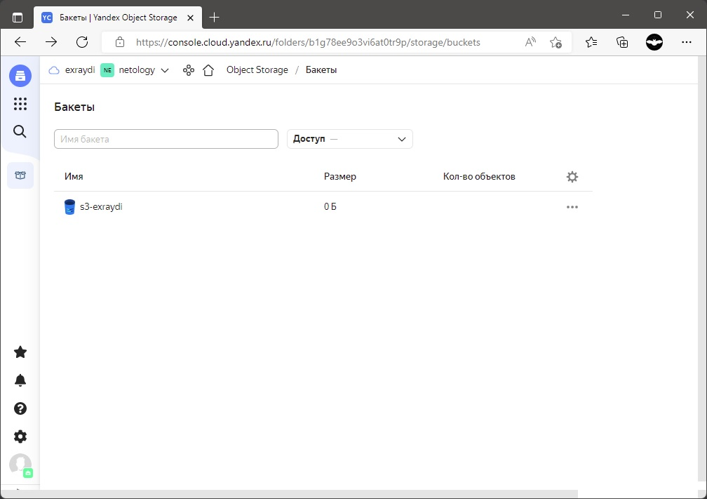 

- Создаем workspace stage, и разворачиваем инфраструктуру: 

```
terraform init -reconfigure -backend-config=./backend.conf
terraform workspace new stage
terraform init && terraform plan && terraform apply --auto-approve
```
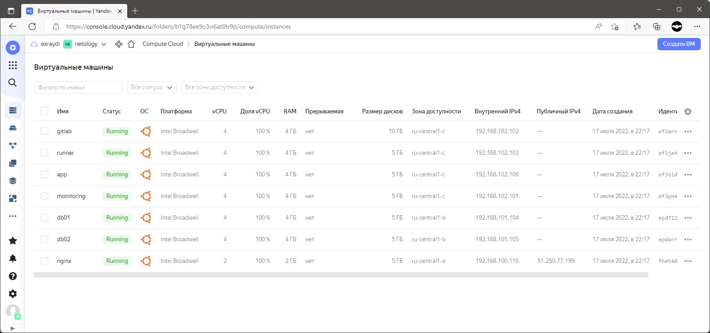 


 - Поднимаются 7 VM, все на основе образа ubuntu-2004-lts. VM nginx (exraydi.ru) - имеет внешний IP адрес, выданный YandexCloud.
 - Происходит автоматчиеская регистраця DNS записей в YandexCloud.


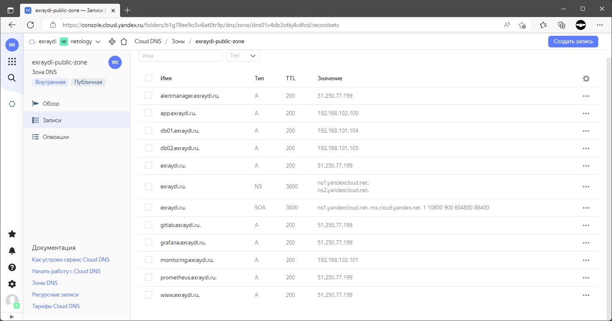

- Далее, автоматически запускается настройка хостов с помощью команды 
  ansible-playbook playbook.yml

### Установка Nginx и LetsEncrypt

 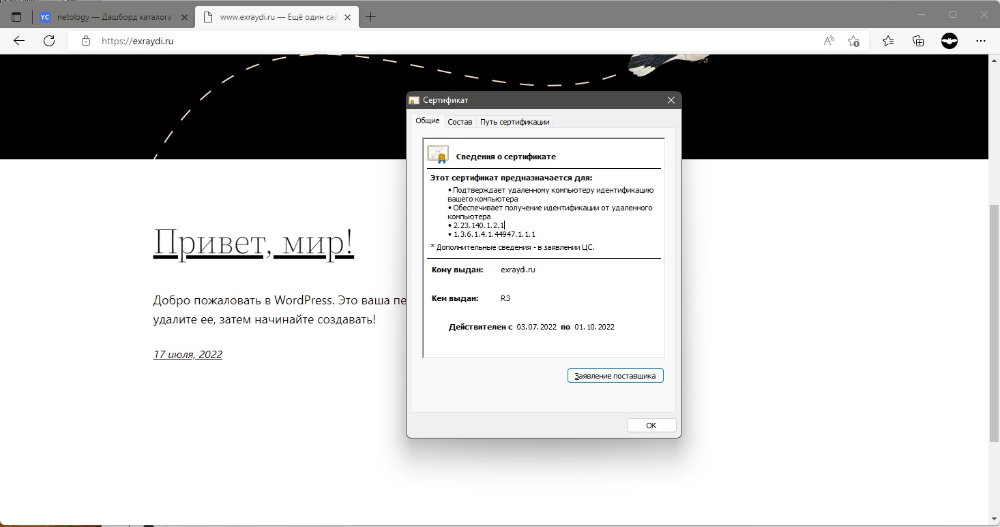

### Установка кластера MySQL

- Результат выполнения таска по разворачиванию кластера MySQL

```
TASK [mysql : Check master replication status.] ************************************************************************
ok: [db02.exraydi.ru -> db01.exraydi.ru]
```

### Установка WordPress

- WordPress развернут и подключен к базе wordpress кластера MySQL

 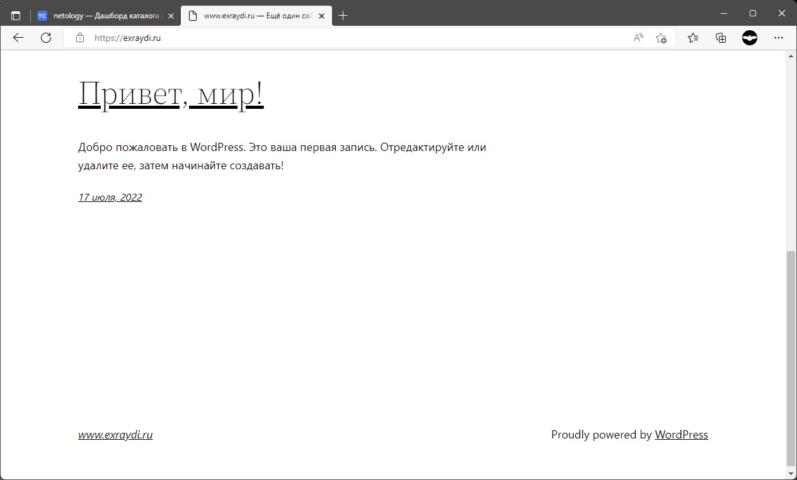

### Установка Gitlab CE и Gitlab Runner

- Runner подключается автоматически, на основе заранее прописанного токена.  

 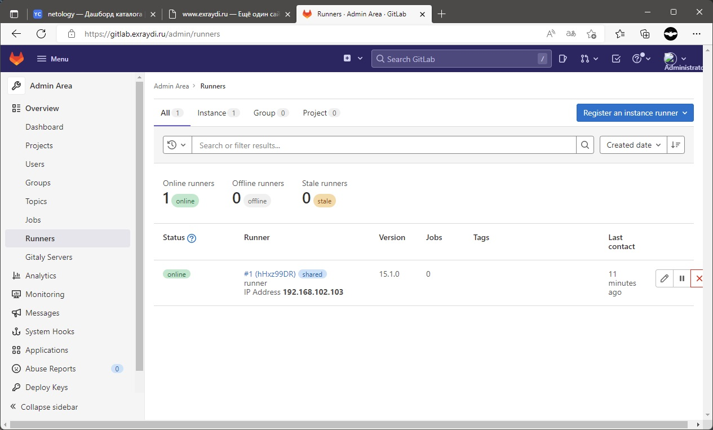

- Клонируем репозиторий WordPress, 

 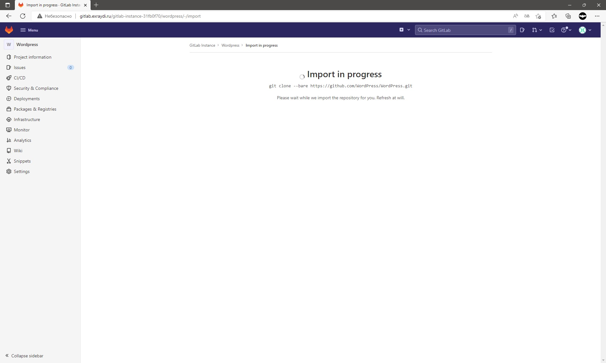
 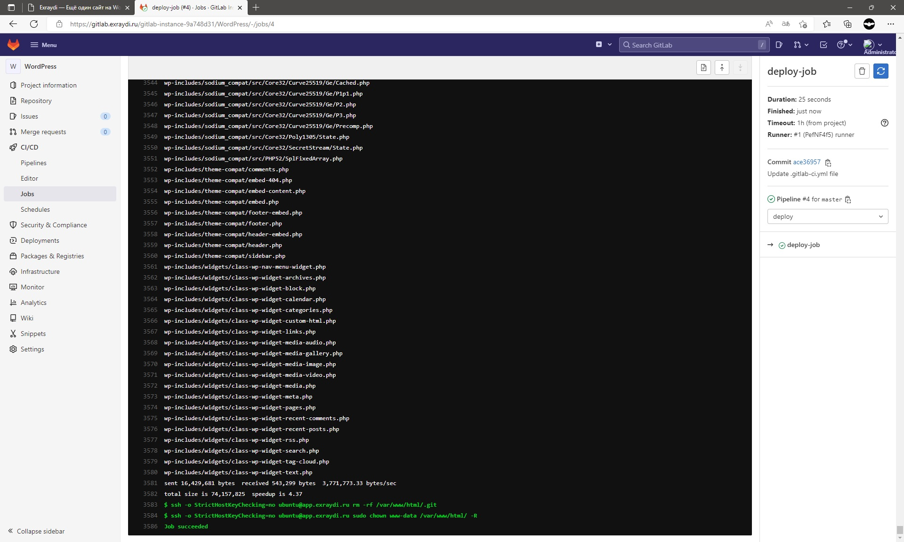


- добавляем файл  .gitlab-ci.yml

```
---
before_script:
  - 'which ssh-agent || ( apt-get update -y && apt-get install openssh-client -y )'
  - eval $(ssh-agent -s)
  - echo "$SSH_PRIVATE_KEY" | tr -d '\r' | s
  - mkdir -p ~/.ssh
  - chmod 700 ~/.ssh

stages:
  - deploy

deploy-job:
  stage: deploy
  script:
    - echo "Deploy"
    - ssh -o StrictHostKeyChecking=no ubuntu@app.exraydi.ru sudo chown ubuntu /var/www/www.exraydi.ru/wordpress/ -R
    - rsync -rvz -e "ssh -o StrictHostKeyChecking=no" ./* ubuntu@app.exraydi.ru:/var/www/www.exraydi.ru/wordpress/
    - ssh -o StrictHostKeyChecking=no ubuntu@app.exraydi.ru rm -rf /var/www/www.exraydi.ru/wordpress/.git
    - ssh -o StrictHostKeyChecking=no ubuntu@app.exraydi.ru sudo chown www-data /var/www/www.exraydi.ru/wordpress/ -R

```
- Пробуем изменить содержиове файла index.php WordPress. 

 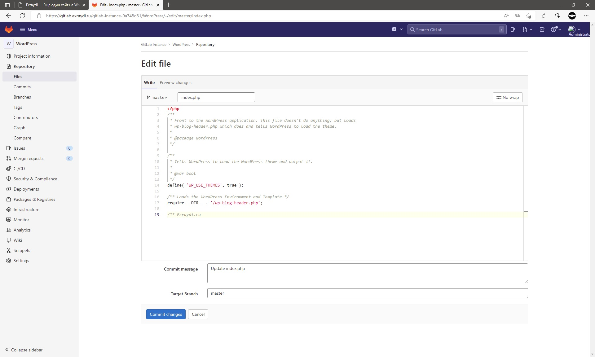

- При выполнении commit запускается deploy 

 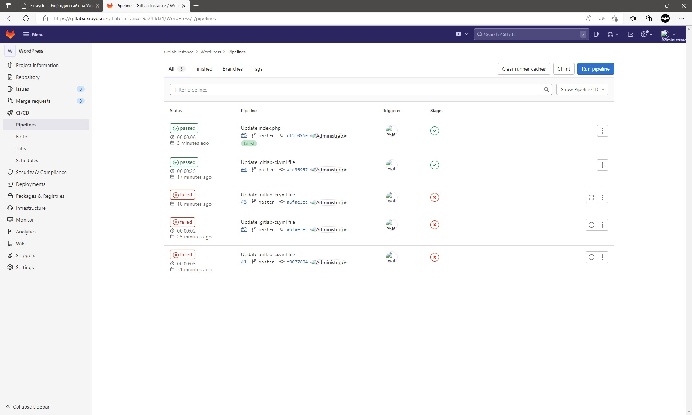

- Проеряем результат на VM app.exraydi.ru.

 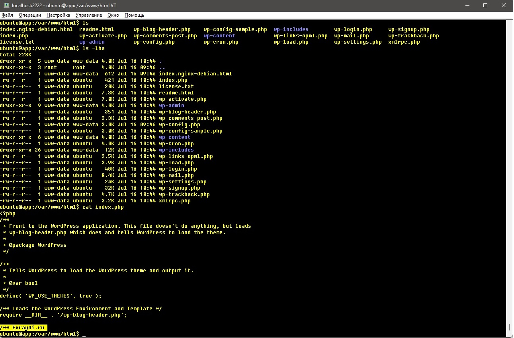

### Установка Prometheus, Alert Manager, Node Exporter и Grafana

- Grafana

 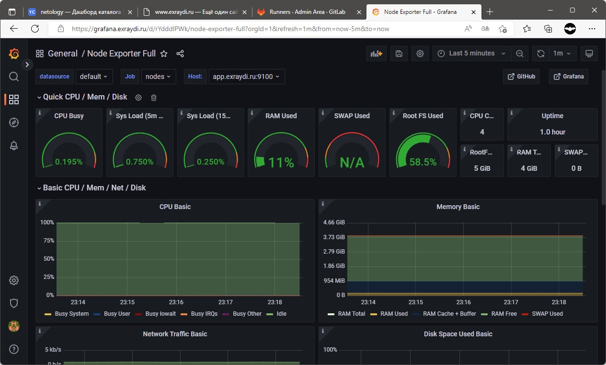

- Prometheus

 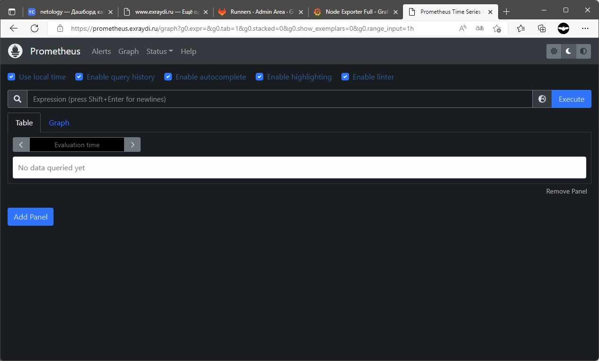

- Alert Manager

 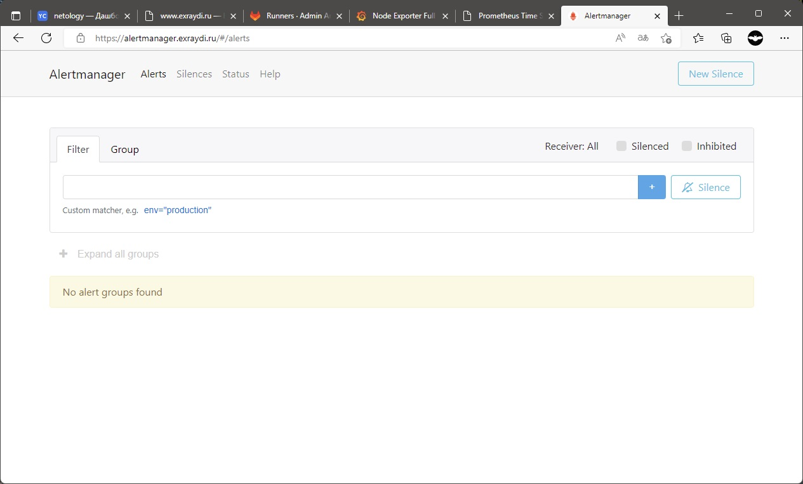

- Срабатывание Alert Manager при отключении одного из VM

 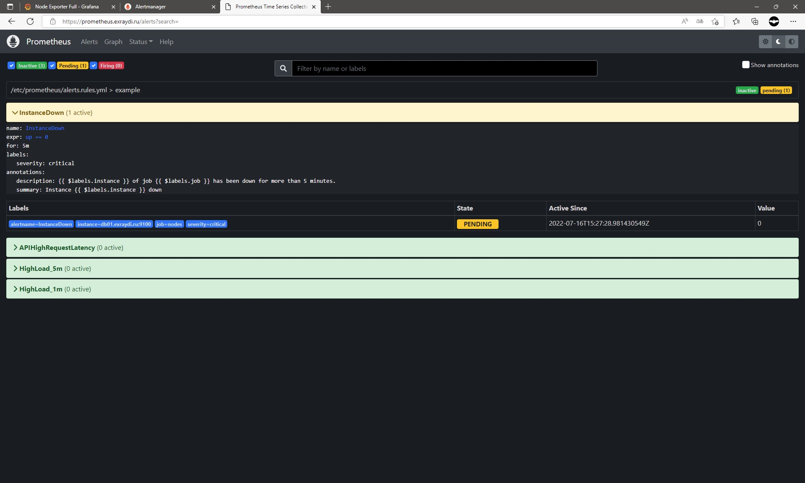
 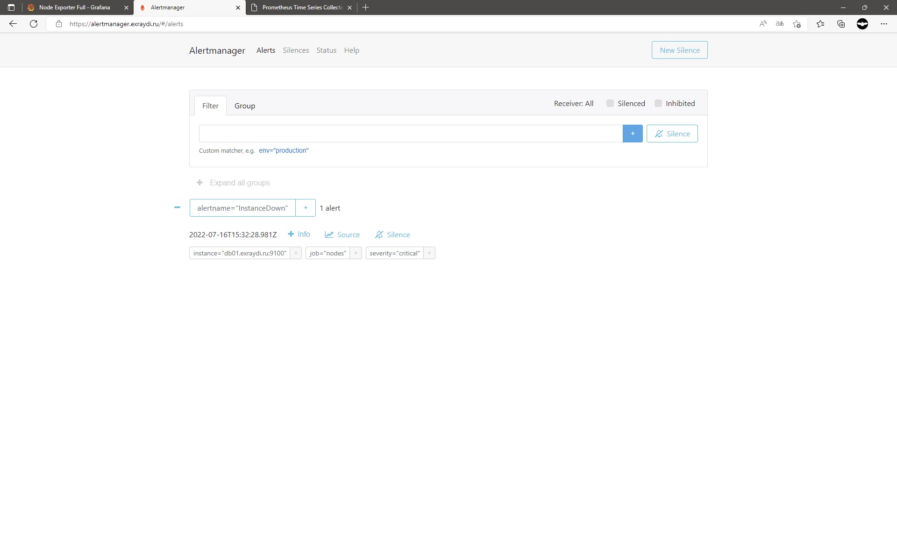

---

### Удаление инфраструктуры 

- Работу по удалению инфратсруктуры выполняет скрип destroy.sh

```
#! /usr/bin/bash
echo "============ Destroy infrastructure ============"
cd stage || return
terraform destroy --auto-approve

echo "============ Destroy S3 backend ============"
cd ../s3_init || return
terraform destroy --auto-approve

```

---
## Что необходимо для сдачи задания?

1. Репозиторий со всеми Terraform манифестами и готовность продемонстрировать создание всех ресурсов с нуля.
2. Репозиторий со всеми Ansible ролями и готовность продемонстрировать установку всех сервисов с нуля.
3. Скриншоты веб-интерфейсов всех сервисов работающих по HTTPS на вашем доменном имени.
- `https://www.podkovka.ru.net` (WordPress)
- `https://gitlab.podkovka.ru.net` (Gitlab)
- `https://grafana.podkovka.ru.net` (Grafana)
- `https://prometheus.podkovka.ru.net` (Prometheus)
- `https://alertmanager.podkovka.ru.net` (Alert Manager)
4. Все репозитории рекомендуется хранить на одном из ресурсов ([github.com](https://github.com) или [gitlab.com](https://gitlab.com)).
